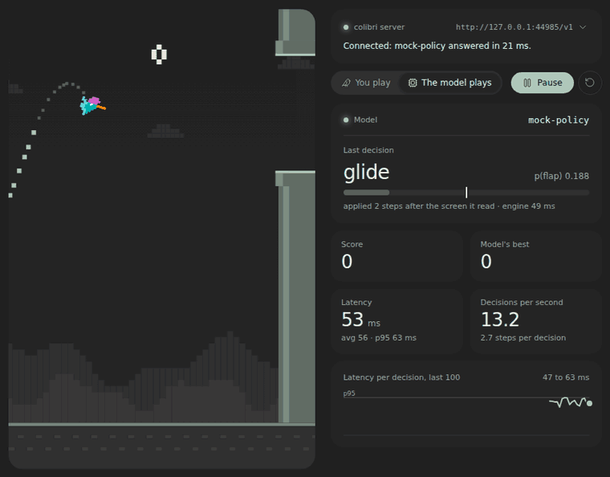
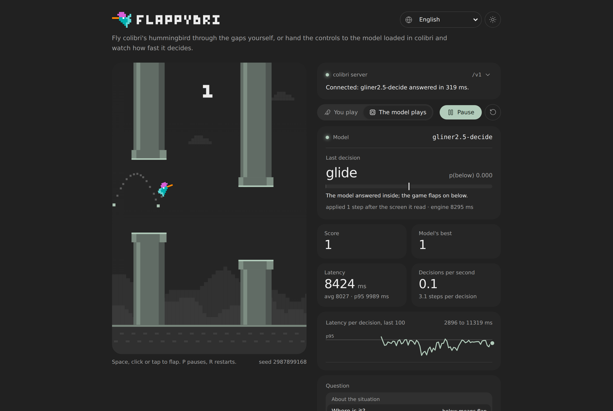
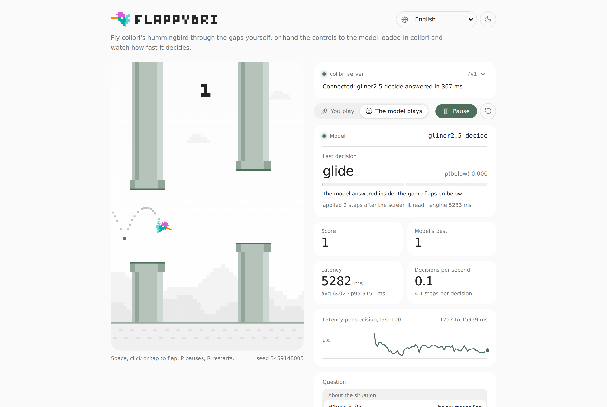
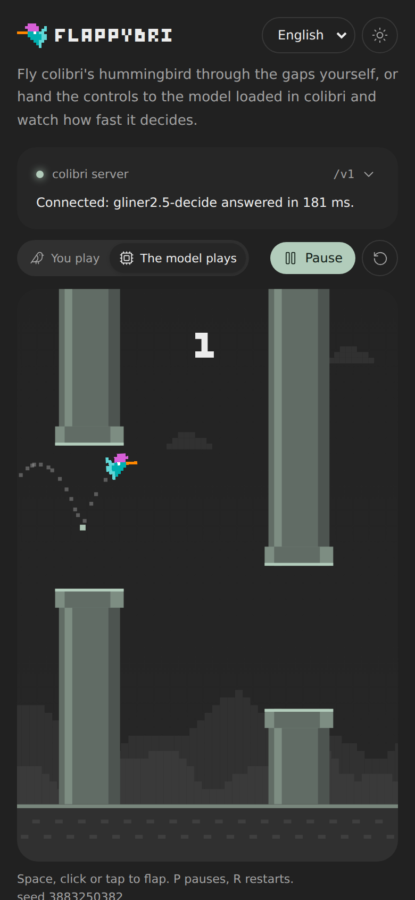

# FlappyBri

<p align="center">
  
</p>

<p align="center"><em>GLiNER2.5-Decide served by <code>coli serve</code> on a laptop CPU shared with other jobs, asked "Where is the hummingbird compared with the opening?" at every step: 13 minutes shown 24 times faster, one frame every 3 s of recording. It reached a score of 5 at 2.0 s per answer on average.</em></p>

FlappyBri is [colibri](https://github.com/JustVugg/colibri)'s hummingbird game.
The hummingbird of colibri's logo flies between pipes, and touching a pipe,
the ground or the top edge ends the round. You can fly it yourself, or hand
the controls to the model running in colibri: at every step the page describes
the screen in plain words and asks it, through colibri's `POST /v1/systemone`
API, where the hummingbird is compared with the opening; the game flaps when
the answer is below, and the panel next to the game shows how fast the model
answers and how sure it is.

It is a small demo you can watch: the speed and the calibration of a decision
model running on your own machine, turned into something that flies.

| Dark | Light | Phone |
| --- | --- | --- |
|  |  |  |

*All three: GLiNER2.5-Decide served by `coli serve`, the default question and the state in words, "Match the model's pace" on, at score 1. The laptop's load average was 34 to 46 from other jobs, and the model took 4.2 to 8.0 s per answer on average.*

## How it works

- **The page describes the screen in plain words.** One sentence of rules
  that never changes, so an engine that reuses a cached prefix reads only
  what follows, then one line about the screen, with no numbers:

  > A small hummingbird is flying through a row of pipes. It must pass through
  > the opening between each pair of pipes. Hitting a pipe, the ground or the
  > ceiling ends the game. Flapping makes it fly up; not flapping makes it drop.
  > The hummingbird is falling fast and is low in the opening, near its bottom
  > edge. The next pipes are coming up.

  It says how the hummingbird moves (falling fast, falling, gliding level,
  rising, rising fast), where it is against the opening (well below, a little
  below, low in the opening near its bottom edge, right in the middle, high in
  the opening near its top edge, a little above, well above), whether the
  ground or the ceiling is close or about to be hit, and whether the next
  pipes are very close, coming up, still far, or being passed. Every boundary
  comes from the game's own constants (`WORDS` in `pilot.ts`): inside the
  opening means the whole body fits; the middle band is a third of a flap's
  rise either side of the middle; "a little below" ends where one flap is no
  longer enough; fast is more than half a flap's speed.
- **The heights are where the hummingbird is about to be.** An answer lands
  about two steps after the screen it was about, and a flap acts on the step
  after that, so the words place the hummingbird three steps ahead, at its
  current speed. A hummingbird falling fast through the middle of the opening
  is described as low in it, because by the time the answer acts, it is. Words
  for where it is now did not work: even read perfectly (flap when the words
  put it lower than the middle), they lose nearly every round once answers
  land 3 steps late; the words three steps ahead fly every round at 1, 2 and 3
  steps late (`oracle.test.ts`).
- **It asks about the situation, not the move.** By default one `choice`:
  "Where is the hummingbird compared with the opening?", with `below` (low in
  the opening or lower, or near the ground), `inside` (right in the middle) and
  `above`. The model only says where the hummingbird is; the game turns that
  into the move: it flaps when p(below) is above the threshold (0.5 unless you
  move it). The panel says which question is asked, what the model answered,
  and which answer means flap. Two more situation questions are there, "Is the
  hummingbird too low?" (yes means flap) and "What is the danger right now?"
  (ground means flap), and the two questions about the move itself ("Should the
  hummingbird flap its wings now?", "flap or glide").
- **Numbers are still there.** "The screen, described in: Numbers" sends the
  distances in px and the speeds in px per frame, then the same numbers as
  JSON, for a model that reads numbers well.
- **One request in flight.** The next question goes out only when the last
  answer has been used, so the model is never asked more than it can answer.
- **Latency is visible as play.** The game does not wait for the model: while
  it reads, the pipes keep coming. The answer applies on the step it arrives,
  to the screen as it is by then, the way a slow reflex would, and the panel
  says how many steps late that was.
- **A slower model can still play.** "Match the model's pace" slows the game
  so that about two steps pass while the model decides, from real time down to
  a thousandth of it (the slider by hand stops at a hundredth): on a busy CPU a
  model can need several seconds per answer, and the words are made for
  answers that land 1 to 3 steps late. One step of physics is always the same;
  only the number of steps per second changes, and the speed the game actually
  runs at is shown.

The panel shows the model's name, the last decision with the model's own
answer and the probability that means flap against the threshold, the latency
of each decision (last, average and p95 over the last 100, with a sparkline,
plus the engine's own time when the browser can read it), decisions per
second, steps per decision, how late each answer landed, and the score and
best (kept apart for you and for the model). "What the model reads" shows the
exact last request.

The physics are deterministic: 60 steps a second of game time, a seeded random
generator for the gaps, the same round for the same seed and the same flaps.

## How well the models read it

Measured with `npm run agreement` (`scripts/agreement.ts`) against two native
decision models served by `coli serve` on a laptop shared with other jobs:
GLiNER2.5-Decide (fastino) and Laya (convaiinnovations).

**The screens.** Rounds played with the game's own code, flown by a plain
rule (the oracle, `oracle.ts`) as it is and with one decision in ten, five and
three flipped, so the screens include the ones a model that errs ends up in.
Every fifth question is kept, and the set is balanced: as many screens where
the oracle flaps as where it glides, or an answer that always glides would
look right most of the time. **The oracle** flaps when, four steps on and
without a flap, the hummingbird would be in the lower third of the opening or
below it; it flies every round to the end when answers land 2 or 3 steps late.
**Agreement** is how often the game's move from the model's answer (p of the
answer that means flap above 0.5) is the oracle's move.

Agreement on 300 held-out screens (seed 1001, never used for tuning), the
state in words, one question per request. In brackets: how often the move was
right on the screens where the oracle flaps, and where it glides.

| Question | GLiNER2.5-Decide | Laya |
| --- | --- | --- |
| **Where is it?** (below means flap, the default) | **96.7%** (93.3 / 100) | **96.3%** (92.7 / 100) |
| Too low? (yes means flap) | 93.0% (94.7 / 91.3) | 50.0% (0 / 100) |
| Danger? (ground means flap) | 85.0% (100 / 70.0) | 50.0% (0 / 100) |
| Should it flap? (the model picks the move) | 50.0% (100 / 0) | 50.3% (100 / 0.7) |
| Flap or glide? (the model picks the move) | 43.0% (68.7 / 17.3) | 32.7% (23.3 / 42.0) |

The words themselves cap the agreement: read the plain way (flap when they put
the hummingbird lower than the middle), they agree with the oracle on 96.7% of
these screens, the oracle looking four steps ahead where the words look three.
GLiNER2.5-Decide asked "Where is it?" matches that plain reading on every one
of the 300; Laya on all but one. On the 300 screens used for tuning (seed 1)
the same question scored 97.3% and 97.0%, against a plain-reading 97.3%.

The two questions about the move, asked on the same words, show what the
situation questions fix: GLiNER2.5-Decide says "flap" to "Should it flap?" on
every screen, and both models do worse than a coin on "flap or glide". Laya
never says yes to "Too low?" and never gives `ground` more than 0.5 on
"Danger?" (it picks `none` on 209 of the 300 screens); of the situation
questions it reads only the where question.

How the words were tuned: on the first 300 screens (seed 1), with the
thresholds and the question fixed by the page's code, only the wording and the
thresholds moved, never the model's answers. Three changes mattered. Saying "low in the opening, near its
bottom edge" instead of "inside the opening, near its bottom edge" took
GLiNER2.5-Decide from 72.0% to 90.7% on "Too low?" and from 57.3% to 95.7% on
"Where is it?" (on all 123 such screens both models had answered "inside"). Letting the answer
`below` cover the low part of the opening took Laya from 51.3% to 95.7%.
Placing the heights three steps ahead with a middle band of 20 px, instead of
two steps and 15 px, raised the plain reading from 95.7% to 97.3% and made it
fly every one of 50 rounds at 1, 2 and 3 steps late and 26 of them at 4,
against none at 4 before. Before that last change, dropping the motion words
would have raised "Too low?" on GLiNER2.5-Decide from 90.7% to 95.7%, and
dropping the pipe words (in a sentence naming the position first) would have
lowered it from 87.0% to 83.3%; "Where is it?" stayed at 95.7% in all of
these, so both kinds of words stay. All these runs shared the
laptop (12 cores) with other jobs, at a load average between 4 and 46.

**Playing.** Agreement is not the score: the game punishes a single
flap in the upper part of the opening. `--play` lets each model fly ten
seeded rounds headless, each answer landing 2 steps after the screen it was
about, the pace "Match the model's pace" aims for. Asked "Where is it?", both
GLiNER2.5-Decide and Laya flew all ten rounds to the 20,000-step cap the
harness sets (217 points each), agreeing with the oracle on 99.1% and 99.0% of
the screens they met. With every other question both models scored 0 in all
ten rounds, "Too low?" included, though GLiNER2.5-Decide agreed with the oracle
on 89.3% of the screens it met there.

In the browser, through `scripts/record.py` with the default settings,
GLiNER2.5-Decide reached a score of 1 in each of the three screenshots while
the laptop's load average was 34 to 46 (4.2 to 8.0 s per answer on average,
0.1 to 0.2 decisions a second, 2.6 to 3.2 steps per decision), and in a
13-minute time-lapse, as the load fell from 32 to 13, the score stood at 5,
its best of the session, when the recording ended (2.0 s per answer on
average, p95 4.6 s, 0.4 decisions a second, 3.7 steps per decision).

**Latency on CPU.** Both models ran on the CPU of a 12-core laptop, six
threads each, next to other jobs, and their latency followed the load. One
request of about 120 tokens took 0.9 to 1.2 s on GLiNER2.5-Decide and 1.2 to
1.4 s on Laya at a load average of 7; the median over 703 requests each was
1.9 s and 1.8 s at a load average between 4 and 26, and 6.8 to 8.6 s between
16 and 46. In the page, during the recording (load average 34 to 46),
GLiNER2.5-Decide answered in 4.2 to 8.0 s on average (p95 7.0 to 10.0 s), 0.1
to 0.2 decisions a second. At that pace "Match the model's pace" runs the game
at a few thousandths of real time and a point takes minutes: the model reads
the screen correctly, but this is not a speed a person would play at. With
the laptop nearly idle (load average 5), the default request, 143 input
tokens, took 0.70 s on GLiNER2.5-Decide, and the "Too low?" one, 91 tokens,
0.37 s.

## The honest note

The model is not trained to play this game. At every step it reads a short
description of the screen and answers one question about it; with the default
question it says where the hummingbird is, and the game, not the model, turns
that into flap or glide. The game also does the arithmetic of where the
hummingbird is about to be. What you are watching is the speed and the
calibration of a decision model running locally, not a game-playing agent. A
model that flies well here is fast and reads a plain description correctly; a
model that crashes may still be a good model that is slow, or one whose
probabilities are not where the threshold expects them.

## Play it with colibri

### 1. Get colibri

Follow colibri's README, section [Get started](https://github.com/JustVugg/colibri#get-started):
it covers the program (a prebuilt release or a build from source), the model,
and `coli`, the launcher that runs everything.

FlappyBri needs a colibri that has the `POST /v1/systemone` route. It is on
colibri's `dev` branch and comes with the next release; until then, build from
source on `dev`:

```bash
git clone https://github.com/JustVugg/colibri && cd colibri
git checkout dev
cd c && ./setup.sh
```

With an older colibri the page tells you so: "This server has no
/v1/systemone route: update colibri."

### 2. Start a model with `coli serve`

```bash
./coli serve --model /path/to/model          # listens on http://127.0.0.1:8000/v1
```

Which models can play: any model colibri serves can answer `/v1/systemone`,
except an image model. A language model answers through calibrated option
scoring: it reads the state and the question and scores the possible answers,
without generating text. That works on every family colibri runs, but it is the
slow path for a game, and how slow depends on the model and the machine. With
"Match the model's pace" on, the game slows down to the model rather than the
other way round. Native decision models are the fast path: GLiNER2.5-Decide
and Laya both read the default question correctly (see
[How well the models read it](#how-well-the-models-read-it)).

### 3. Run FlappyBri

You need [Node.js](https://nodejs.org/) 20.19 or newer.

```bash
git clone https://github.com/JustVugg/flappybri && cd flappybri
npm install
npm run dev                                  # http://localhost:5173
```

Or build it once and serve the files:

```bash
npm run build                                # writes dist/
npm run preview                              # http://localhost:4173, see CORS below
```

`dist/` is a static site with relative paths: any static file server works,
from any folder. Serve it over http rather than opening `index.html` from disk.

### 4. Connect and let the model play

1. Open the page. The connection panel at the top of the controls holds the
   colibri server URL, `http://127.0.0.1:8000/v1` by default, and an optional
   API key (the one given to `coli serve --api-key` or `COLI_API_KEY`).
2. Press **Test connection**. It calls `GET /models` on the server and shows
   the model id, for example "Connected: qwen36 answered in 14 ms." The URL and
   the key are saved in this browser (localStorage) and tested again each time
   the page opens.
3. Choose **The model plays** and press **Start**.

If something is wrong, the panel says what: no answer (the server is down, or
the browser blocked a cross-origin request, see below), a missing or wrong key,
an address that is not a colibri `/v1`, or an image model. If the model fails
during a round, the page says why and hands the controls back to you.

### Calling colibri from another origin (CORS)

The page and colibri run on different origins (`localhost:5173` and
`127.0.0.1:8000`), so the browser checks colibri's cross-origin answers. This
is what `coli serve` does today, read from its gateway (`c/openai_server.py`)
and checked against it:

- **Preflight:** it answers `OPTIONS` with 204 and the CORS headers, without
  asking for the key.
- **Allowed origins:** by default `http://localhost:5173`,
  `http://127.0.0.1:5173`, `http://localhost:8000` and `http://127.0.0.1:8000`
  (plus colibri's desktop app). For an allowed origin it sends
  `Access-Control-Allow-Origin` with that origin; for any other it sends no CORS
  headers, and the browser blocks the reply.
- **Authorization:** allowed. `Access-Control-Allow-Headers` lists
  `Authorization` and `Content-Type`, so a key works cross-origin.
- **Exposed headers:** `x-request-id`, `x-colibri-queue-wait-ms` and
  `Retry-After`, but not `x-colibri-elapsed-ms`, so cross-origin the panel
  cannot show the engine's own time per decision. Everything else works.

What to do:

- **`npm run dev` on port 5173: nothing.** Stock `coli serve` already allows
  it. The dev server refuses to start on another port rather than move to one
  colibri would not allow.
- **Any other origin** (`npm run preview` on 4173, a static server, another
  port): start colibri with that origin allowed. `--cors-origin` replaces the
  default list, so repeat it for every origin you use:

  ```bash
  ./coli serve --model /path/to/model \
    --cors-origin http://localhost:4173 --cors-origin http://localhost:5173
  ./coli serve --model /path/to/model --cors-origin '*'     # any origin
  ```

- **Or skip CORS: use the proxy.** `npm run dev` and `npm run preview` forward
  `/v1` to colibri, so the page and the API share one origin. Set the server URL
  in the panel to `/v1`. The proxy sends to `http://127.0.0.1:8000` unless you
  set `COLIBRI_URL`:

  ```bash
  COLIBRI_URL=http://127.0.0.1:8001 npm run dev
  ```

  Through the proxy the engine's own time is visible too.

**colibri on another machine.** `coli serve` refuses a non-loopback bind
without a key, and checks the `Host` header the browser sends. Bind with
`--host` and `--api-key`, and if the browser reaches the server by a name or
address other than the one it binds to, add `--allowed-host <that name>`.

**A note on latency.** With today's gateway, a browser calling `coli serve`
directly can see about 40 ms more per decision than the engine spends: the
reply's headers and body go out as two writes, and on a kept-alive connection
the second waits for a delayed TCP acknowledgement. That time is the
connection's, not the model's. Through the `/v1` proxy the wait does not
happen, so use it when you want to see the fastest numbers.

## The request it sends and the field it reads

Every step, `POST {server URL}/systemone` with `Content-Type: application/json`
and, if you set a key, `Authorization: Bearer <key>`. With the default question
and the state in words:

```json
{
  "model": "gliner2.5-decide",
  "state": "A small hummingbird is flying through a row of pipes. It must pass through the opening between each pair of pipes. Hitting a pipe, the ground or the ceiling ends the game. Flapping makes it fly up; not flapping makes it drop.\nThe hummingbird is falling fast and is low in the opening, near its bottom edge. The next pipes are coming up.",
  "questions": {
    "where": {
      "type": "choice",
      "instructions": "Where is the hummingbird compared with the opening?",
      "criteria": {
        "below": "low: near the bottom edge of the opening or lower, or near the ground",
        "above": "high: near the top edge of the opening or higher, or near the ceiling",
        "inside": "right in the middle of the opening"
      }
    }
  }
}
```

The reply, and the field the game reads, `answers.where.probabilities.below`:

```json
{"id": "req_d57ff7ed74694d77a7d7d727bf9e43e0", "model": "gliner2.5-decide", "provider": "colibri", "answers": {"where": {"type": "choice", "choice": "below", "probabilities": {"below": 0.999839, "above": 5.2e-05, "inside": 0.000108}, "confidence": 0.999759}}, "usage": {"input_tokens": 143, "output_tokens": 0, "cost": 0}}
```

p(below) is 0.9998, above the threshold of 0.5, so the game flaps. The same
screen asked "Is the hummingbird too low?", a `noul` under `low`, and the game
reads `answers.low.noul`, the probability of yes:

```json
{"id": "req_5ef1c5b8fb2e4c44a31804e042254cd5", "model": "gliner2.5-decide", "provider": "colibri", "answers": {"low": {"type": "noul", "noul": 0.981668}}, "usage": {"input_tokens": 91, "output_tokens": 0, "cost": 0}}
```

"What is the danger right now?" is a `choice` under `danger` with the labels
`ground`, `ceiling` and `none`, and the game reads
`answers.danger.probabilities.ground`. The two move questions are a `noul`
under `flap` ("Should the hummingbird flap its wings now?") and a `choice`
under `move` between `flap` and `glide`, each with what it does.

These are real exchanges with GLiNER2.5-Decide served by `coli serve`, the
requests built by the page's own code. The `model` field of the request is the
id the connection test found; colibri answers with the model it runs. The
page also reads the `x-colibri-elapsed-ms` response header when the browser
can see it (see CORS above).

## Controls and settings

| | |
| --- | --- |
| **Space, click or tap** | Flap when you play; start or resume otherwise |
| **P** | Pause and resume (a hidden tab pauses too) |
| **R** | Restart |
| **Who plays** | You play, or The model plays |
| **Question** | About the situation, the game turns the answer into the move: Where is it? (below means flap, the default), Too low? (yes means flap), Danger? (ground means flap). About the move, the model picks it: Should it flap? (yes means flap), Flap or glide? |
| **The screen, described in** | Words (the default): no numbers, where the hummingbird will be against the opening when the answer lands. Numbers: distances in px and speeds in px per frame, then JSON |
| **Flap above** | The threshold, 0.05 to 0.95 (default 0.5): the game flaps when the probability of the answer that means flap is strictly above it |
| **Game speed** | From 0.01x to 1x of real time. Slower game time gives a slower model time to react |
| **Match the model's pace** | On by default in model mode: sets the speed so that about two steps pass while the model decides, down to 0.001x |
| **Start the next round by itself** | In model mode, a new round starts 1.6 s after a crash |

The settings, the language and the theme are remembered in the browser (settings
saved by an older version still load: a saved "Yes or no", the old default,
moves to the new default question), and the best scores are kept apart for you and for the model. The page follows the
system's dark or light theme until you pick one, works at phone widths down to
320 px, and with reduced motion requested it keeps only the motion the game
needs (no drifting hills, wing beats, tilt or crash flash). It speaks English,
Italian, German, Indonesian and Chinese (simplified and traditional).

## Try it without colibri

`scripts/mock_server.py` is a mock decision server: the same routes, request
and reply shapes as colibri's gateway, answered by a fixed rule (the
probability of the answer that means flap grows as the words, or the numbers,
put the hummingbird below the middle of the opening), held back 40 to 60 ms per
answer. It is not a model and calls itself `mock-policy`.

```bash
npm run mock                                 # http://127.0.0.1:8011/v1
```

Then set the server URL in the panel to `http://127.0.0.1:8011/v1`. It allows
any origin, and `--key` makes it require an API key.

## Development

```bash
npm test                 # vitest: physics, the words and the questions, the oracle, settings, statistics, the API client, the connection panel, i18n
npm run build            # type check and production build into dist/
npm run dev              # dev server on http://localhost:5173
```

### Measuring a model

`npm run agreement` asks a running server about sampled screens and prints the
agreement table above; `--play N` also lets the model fly N headless rounds.
Answers are cached by the exact request in `agreement-cache.json`, so a second
run asks only what changed.

```bash
npm run agreement -- --server gliner=http://127.0.0.1:8017/v1 --server laya=http://127.0.0.1:8018/v1 \
  --forms where,low,danger,noul,choice --states 300 --seed 1001 --play 10
```

The game is plain TypeScript in `src/lib/flappybri/`: `game.ts` (world and
physics), `pilot.ts` (the state the model reads, in words or numbers, the
questions, one request at a time), `oracle.ts` (the yardstick the agreement is
measured against, not used by the page), `stats.ts` (latency window, p95,
decisions per second) and `render.ts` (the canvas). `src/FlappyBri.tsx` is the
loop and the panel, `src/lib/settings.ts` the saved settings,
`src/ConnectionPanel.tsx` and `src/lib/connection.ts` the connection panel,
`src/lib/api.ts` the two HTTP calls.

### Recording the screenshots and the GIF

`scripts/record.py` makes `docs/media/desktop-dark.png`, `desktop-light.png`,
`phone.png` and `flappybri.gif` with the model playing. It needs Python 3 with
[Playwright](https://playwright.dev/python/) (`pip install playwright` and
`playwright install chromium`) and Pillow.

```bash
npm run build
python3 scripts/record.py                                    # against the mock
python3 scripts/record.py --server http://127.0.0.1:8000/v1  # against coli serve
python3 scripts/record.py --server http://127.0.0.1:8000/v1 --key "$COLI_API_KEY" --timeout 300
python3 scripts/record.py --server http://127.0.0.1:8000/v1 --form low --style numbers   # another question or style
python3 scripts/record.py --server http://127.0.0.1:8000/v1 --only gif --seconds 780 --fps 0.33 --speedup 24 \
  --gif-width 640 --colors 64
```

The last line is for a slow model: at several seconds per answer the game runs
at a few thousandths of real time, so it records 13 minutes at a frame every
3 s and plays them back 24 times faster. That is how the GIF above was made
(captured at a frame a second, every third frame kept).

It serves `dist/` itself and forwards `/v1` to `--server`, so no CORS setting
is needed. A slow model needs a longer `--timeout`, and `--seconds` sets the
length of the GIF. When the media come from another model, change the captions
above to say which one.

## License

Apache-2.0, see [LICENSE](LICENSE). The hummingbird is colibri's logo, by the
same author and under the same license. The pixel font, Bytesized, is under
the SIL Open Font License 1.1 ([src/assets/fonts/OFL.txt](src/assets/fonts/OFL.txt)).
